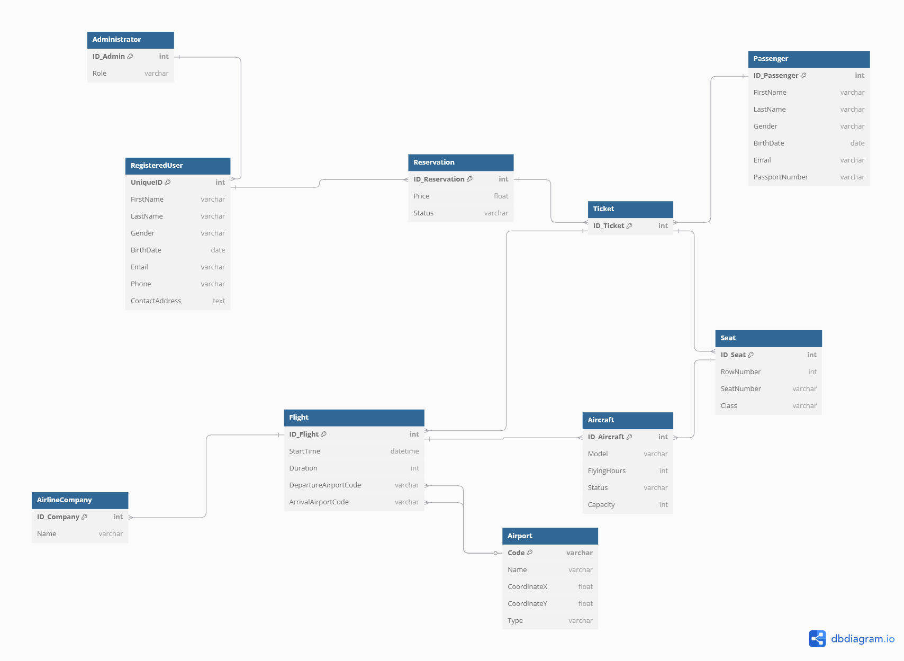

# Airline Reservation System Database Project

This document provides an overview of the database architecture designed for the Airline Reservation System. The design focuses on clear separation of business entities and explicit relationship management to support essential operations such as reservations, flight scheduling, and seat management.

## Table of Contents

- [Entities](#entities)
- [Relationships](#relationships)
- [Design Considerations](#design-considerations)
- [Potential Enhancements](#potential-enhancements)
- [Conclusion](#conclusion)

## Entities

The system models the following major entities:

- **Reservation**: Stores booking details including price and status.
- **RegisteredUser**: Holds user profiles with personal details and contact information.
- **Passenger**: Contains information about the individuals who will travel, including identification details such as passport number.
- **Ticket**: Represents the issued ticket for a reservation.
- **Seat**: Contains details about seat assignments including row and seat number, as well as class type.
- **Flight**: Maintains flight-specific data like departure and arrival times, as well as linked airport codes.
- **Airport**: Keeps a record of airports using a unique code along with location and type details.
- **Aircraft**: Includes information about the aircraft, such as model, capacity, and operating status.
- **AirlineCompany**: Represents the airline operating the flights.
- **Administrator**: Models system administrators who are a subset of RegisteredUsers with additional role-based controls.

## Relationships

The database architecture defines clear relationships between entities to reflect real-world associations:

- A **Reservation** can have multiple **Tickets**.
- A **Passenger** may be associated with multiple **Tickets**.
- A **RegisteredUser** creates one or more **Reservations**.
- Each **Ticket** corresponds to one **Seat** and one **Flight**.
- **Seats** belong to an **Aircraft**.
- Each **Flight** includes foreign keys for both its **Departure Airport** and **Arrival Airport**.
- An **Aircraft** operates multiple **Flights**.
- An **AirlineCompany** is associated with multiple **Flights**.
- **Administrator** records extend **RegisteredUser** information (1:1 relationship).

## Design Considerations

- **Normalization**:
  - The design minimizes data redundancy by keeping related but distinct information (e.g., user profile vs. passenger details) in separate tables.
- **Explicit Foreign Keys and Cardinalities**:
  - Relationships are defined using foreign keys that enforce referential integrity. For example, `Flight` includes both `DepartureAirportCode` and `ArrivalAirportCode` that link to the `Airport` entity.

## Potential Enhancements

- **Indexes**:
  - Establish indexes on frequently queried fields such as airport codes, flight IDs, and user identification numbers.
- **Audit Trails**:
  - Implement fields to track record creation and update timestamps, which would support better monitoring and data recovery efforts.
- **Enumerated Types and Constraints**:
  - Convert attributes like `Status` in Reservations and `Role` in Administrators to enumerated types or controlled vocabularies to ensure data consistency.

## Evaluation of the project

- The project was evaluated 33/34 points. One point was lost due to the small scale of the usecase diagram. Scripts that create tables, views, triggers can be found in the repository.
